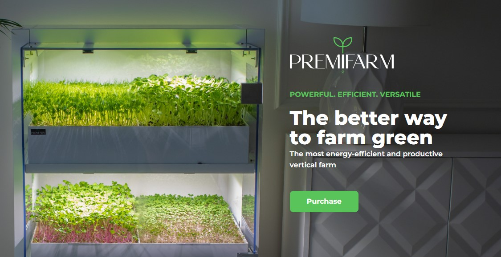
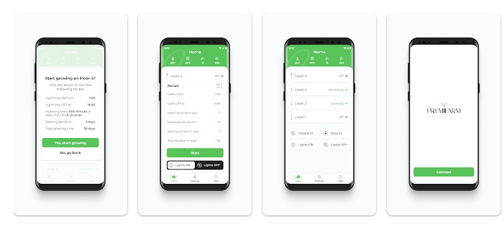

# Google App Store
https://play.google.com/store/apps/details?id=com.premifarm.grower&pli=1



# Relation URLS

https://grower.free.beeceptor.com/getfloorsnumber       
https://grower.free.beeceptor.com/get_floor1        
https://capacitor-community.github.io/electron/docs/gettingstarted

# Premifarm
 Ionic(React, typescript, Tailwind CSS)
 
## Build scripts for android / ios
```
npm run build
```
```
npx ionic capacitor add android
npx ionic capacitor add ios
or
cap add android
cap add ios
```
```
npx ionic capacitor copy android
npx ionic capacitor copy ios
```

## Open android studio / Xcode
```
npx ionic capacitor open android
npx ionic capacitor open ios
```

## Live develop with android emulator
```js
ionic capacitor run android
ionic capacitor run android -l --external
```

## Generate App icon and Splash Screen
```
cordova-res android --skip-config --copy
cordova-res ios --skip-config --copy

```
